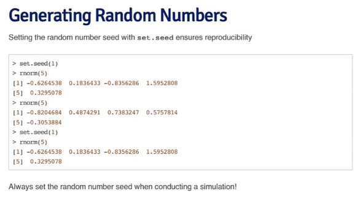

# Probability

```{r, echo=FALSE, results='hide', message=FALSE}
library(bayesrules)
library(janitor)
library(tidyverse)

```


## Normal distribution

- **Generating Random Numbers**  
`r`:generate **random** normal variates
`d`:evaluate the normal probability **density**
`p`:evaluate the **cumulative distribution**
`q`:calculates **quantile**

Specify mean and sd, as they are the important values for simulation.
Always `set.seed` if you want to generate same result (run again before the code). 

```{r, echo=FALSE, out.width="70%", fig.align='center'}

```


`pnorm`
probability of observing a particular value
pnorm(observation, mean, sd)
```{r}
pnorm(7, 11.2, 2.8) # probability of observing 7 when the mean is 11.28 and sd is 2.8
pnorm(15, 11.2, 2.8, lower.tail = FALSE) # this calculates upper value since 15 is more than the mean
pnorm(14:16, 15, 10)
```


`qnorm`
What is the value of particular percentile, i.e. quantile?
qnorm(proportion, mean, sd)
```{r}
qnorm(0.2, 11.2, 2.8) # what is the value at 20% when the mean is 11.28 and sd is 2.8.
qnorm(0.2, 11.2, 2.8, lower.tail = FALSE) # upper = 80%
qnorm(0.8, 11.2, 2.8) # this is the same as the above line
```


`rnorm`
creates random data
rnorm(number of observations, mean, sd)
```{r}
males <- rnorm(15, 10.3, 2.6) # 15 observations with mean 10.3 and sd 2.6
females <- rnorm(15, 6.4, 3.8)
both <- c(males, females)
sex <- c(rep("M", 15), rep("F", 15)) # replicates 15 M and F for each
range_sex <- cbind(both, sex)
range_sex
```


`dnorm`
probability of distribution function
dnorm(vector of quantiles, mean, sd)
```{r}
sample.distribution <- 50:150
distribution <- dnorm(sample.distribution, 100, 15) # how the distribution will look like when there are 101 observations with mean 100 and sd 15
iq.df <- data.frame(sample.distribution, distribution)
ggplot(data = iq.df, aes(x=sample.distribution, y=distribution)) +
  geom_point()
sum(iq.df$distribution) # almost 100%
```


## Bernoulli trial and Binomial distribution
success/failure condition, n choose k
```{r}
dbinom(5, 6, 0.5) # (k(number of success), n(number of trial), p(probability of success) )

0.5**6*6 # cooool this gives the same value. 


dbinom(3, 6, 1/6) # e.g., getting 6 three times in six trials

success <- (1/6)**3
failure <- (5/6)**3
scenario <- success*failure
ways <- choose(6,3) # this is n choose k (possible order of getting k successes in n trials)
scenario*ways # this gives the same result. Or simply = (1/6)**3*(5/6)**3*20 


sum(dbinom(0:4, size = 20, p = 0.5)) # this gives the p-value of, if in fact the probability of getting pregnant is equally the same (0.5), how probable to get k = 4 or less (number of women who get pregnant), when the size is 20.
dbinom(0:4, size = 20, p = 0.5) # if did not use sum function, it gives all the p-value for pregnant 0 to 4 women.


```


Ex:
```{r}
# what is the probability of getting 7 or more girls out of 8 births (gender independent and 50% probability for each)?

choose(8, 7)*.5^8 + choose(8, 8)*.5^8

#or

pbinom(6, 8, 0.5, lower.tail = FALSE) # I think this is the complement of 7 or 8...

# or :)
dbinom(7, 8, 0.5) + dbinom(8, 8, 0.5)
dbinom(4,5,0.5) + dbinom(5,5,.5)


```


Ex: What would be the probability of getting 1 or more yellow M&M in a bag of 5 M&M’s? (there are 5 possible color including yellow)
```{r}
prob = dbinom(1, 5, 0.1) + dbinom(2, 5, 0.1) + dbinom(3, 5, 0.1) + dbinom(4, 5, 0.1) + dbinom(5, 5, 0.1)

# or, use at least way of thinking

prob = 1 - dbinom(0, 5, 0.1)

prob
```


## Poisson distribution
for counting, often times within specific time frame

```{r}
# What is the probability that 3 or fewer people show up at the bus stop in 4 hours when the mean is 2.5 per hour?

ppois(3, lambda = 2.5*4)


# What is the probability of getting head 2 times in 500 tosses when the probability is 0.01?
ppois(2, lambda = 500*0.01)

# or using binomial distribution
pbinom(2, size = 500, prob = 0.01)

```


## Simulation
Generating random numbers from a linear model
$$y=\beta_0+\beta_1+\epsilon$$
where $\epsilon \sim \text{N}(0,2^2).$ Assume $x \sim \text{N}(0,1^2),\beta_0=0.5 \text{ and } \beta_1=2$.

```{r}
set.seed(20)
x <- rnorm(100)
e <- rnorm(100,0,2)
y <- 0.5+2*x+e
summary(y)
plot(x,y)
```


together with `replicate`
we want to simulate 100 *groups* of random numbers, each
| containing 5 values generated from a Poisson distribution with mean 10.
```{r}
replicate(100, rpois(5,10))


```

