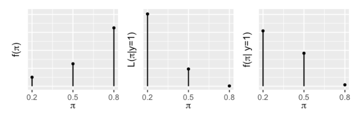

# Bayesian Statistics

```{r, echo=FALSE, results='hide', message=FALSE}
library(bayesrules)
library(janitor)
library(tidyverse)
library(statsr)
library(knitr)
library(kableExtra)
```


### Conjugate family
```{r}

gamma(4) # gamma(4) = (4-1)! = 3*2*1 = 6


# Poisson ‘Pois(k = 1, lambda = 2)‘
dpois(1, lambda = 2)

# Beta ‘Beta(x = 0.5, alpha = 2, beta = 3)‘
dbeta(0.5, shape1 = 2, shape2 = 3)

# Gamma ‘Gamma(x = 1, k = 2, theta = 3)‘
dgamma(1, shape = 2, scale = 3)

# Gamma ‘Gamma(x = 1, alpha = 2, beta = 3)
dgamma(1, shape = 2, rate = 3)

```


## Bayesian Inference

### Comparing two paired means using Bayes factors
Cauchy for unknown variables

Ex: **Trace metals concentration**
Ten pairs of data were taken measuring the zinc concentration in bottom and surface water at ten randomly sampled locations.
It may be reasonable to assume that the differences in the concentration at the bottom and the surface in randomly sampled locations are independent of each other.
```{r}


bayes_inference(difference, data=zinc, statistic="mean",
                type="ht",prior="JZS", mu_0=0, method="theo",
                alt="twosided")

```


From the Bayes' factor $BF[H2:H1] = 50.7757$, we can see that there is an indication that the hypothesis 𝐻2, the mean difference is different from 0, is almost 51 times more likely than the hypothesis 𝐻1 that the average concentration is the same at the surface and the bottom.


### Comparing independent means: Hypothesis Testing

Ex: **Weight gain and age of moms**
Do the data provide convincing evidence of a difference
between the average weight gain of older moms and the average weight gain of
younger moms?

```{r}
data(nc)
bayes_inference(y=gained, x=mature, data=nc,type='ht',
                statistic='mean', alternative='twosided',
                null=0, prior='JZS', r=1, method='theo',
                show_summ=FALSE)


```


We see that the Bayes factor for 𝐻1 to 𝐻2 is about 5.7, with positive support for 𝐻1 that there is no difference in average weight gain between younger and older women.


Ex: **Weight of babies and smoking habit**
- 1. Is there a difference in average birth weight between smoker/non-smoker?
- 2. If there is a difference, how large is the effect?
```{r}
out <- bayes_inference(y=weight, x=habit, data=nc,type='ht', null=0,
                statistic='mean', alternative='twosided',
                prior='JZS', r=.5, method='sim',
                show_summ=FALSE)


```

We see that the Bayes factor is **1.44**, which weakly favors there being a difference in average birth weights for babies. Converting this to a probability, we find that there is about a **60%** chance of the average birth weights are different.

It should not be forgotten though, that credible interval or complete posterior distribution is more relevant in quantifying the magnitude of the effect.

```{r}
out.ci <-bayes_inference(y=weight, x=habit, data=nc,
                         type='ci', statistic='mean',
                         prior='JZS', mu_0=0, r=.5, 
                         method='sim', verbose=FALSE)
print(out.ci$summary, digits=2)

```

The results show under 𝐻2, there is a 95% chance that the average birth weight of babies born to non-smokers is **0.023 to 0.57** pounds higher than that of babies born to smokers.

In order to reflect the uncertainty that the probability of 𝐻2 is true is 0.59%, we can compute the probability that 𝜇 is between 0.023 and 0.57 using **the law of total probability**.

$$\begin{aligned}
& P(0.023 < \alpha < 0.57 \mid \text{data}) \\
= & P(0.023 < \alpha < 0.57 \mid \text{data}, H_1)P(H_1 \mid \text{data})  + P(0.023 < \alpha < 0.57 \mid \text{data}, H_2)P(H_2 \mid \text{data}) \\
= & I( 0 \text{ in CI }) P(H_1 \mid \text{data})  + 0.95 \times P(H_2 \mid \text{data}) \\
= & 0 \times 0.41 + 0.95 \times 0.59 = 0.5605
\end{aligned}$$


### Ex: **Fake News and exclamation**
What is the probability of article being fake, given that it has an exclamation mark in the title?

$$P(\text{ fake }|\text{ exclamation })$$

In the data set, around 60% of the articles are "real", and 40% are fake.
So, the **prior probability** of real versus fake is 0.6 ($B^c$) vs 0.4 ($B$).
```{r}
data("fake_news")
fake_news %>%
  tabyl(type) %>%
  adorn_totals("row")
```


From below, we see that the proportion of articles using "!" (denoted as $A$ for !", and $A^c$ for without "!") in its title among fake articles is 26.6%, whereas that of real articles is only 2.2%.

```{r}
fake_news %>%
  tabyl(title_has_excl, type) %>%
  adorn_totals("row")

prop.table(table(fake_news$title_has_excl, fake_news$type), margin = 2)

```


- **Conditional probability**
When $B$ is known, the conditional probability $P(*|B)$ allows us to compare the probability of an unknown event $A$ or $A^c$ occurring with $B$.
$$P(A|B) \text{ vs } P(A^c|B).$$


- **Likelihood**  
When $A$ is known, the likelihood function $L(*|A) = P(A|*)$ allows us to evaluate the relative compatibility of events $B$ or $B^c$ with data $A$:
$$L(B|A) \text{ vs } L(B^c|A).$$


$$L(B|A)=P(A|B)$$
$$L(B^c|A)=P(A|B^2)$$.

This is to say, when you know that the article uses exclamation ($A$ is known), the likelihood that it is a fake news is as follows.
(using the conditional probabilities of exclamation point usage ($A$) given an articles' fake or non-fake status ($B$ or $B^c$)):
$$ P(A|B) = 0.2667$$
$$P(A | B^c) = 0.0222$$
Prior probability and likelihood are summarized in the Table \@ref(tab:likelihood).


```{r likelihood, echo = FALSE}
B <- c(0.4,0.2667)
Bc <- c(0.6,0.0222)
Total <- c(1,0.2889)
prior_table <- do.call(cbind,list(B,Bc,Total))
dimnames(prior_table) <- 
  list(c("prior probability","likelihood"),
       c("$B$","$B^c$","Total"))
knitr::kable(prior_table, booktabs = T, caption = "Prior probability and likelihood") %>%
  kable_styling(full_width = F)
```


- **Joint probability**  
We should get marginal probability, which is the probability of observing exclamation points across *all* articles.

$$P(A\&B)= P(A|B)P(B)=0.2667*0.4=0.1067$$
$$P(A^c\&B)=P(A^c|B)P(B)=0.7333*0.4=0.2933$$
$$P(A\&B^c)=P(A|B^c)P(B^c)=0.0222*0.6=0.0133$$
$$P(A^c\&B^c)=P(A^c|B^c)P(B^c)=0.9778*0.6=0.5867$$

```{r joint-prob, fig.align='center',echo=FALSE}
a1 <- c("$A$","$A^c$","$\\text{Total}$")
a2 <- c(0.1067,0.2933,round(0.4,1))
a3 <- c(0.0133,0.5867,round(0.6,1))
a4 <- c(0.12,0.88,1)
df2 <- data.frame(a1,a2,a3,a4)
colnames(df2) <- c("  ","$B$","$B^c$","$\\textbf{Total}$")
knitr::kable(x = df2, booktabs = TRUE, caption = "A joint probability") %>%
  kable_styling(full_width = F)
```


Thus, the joint probability can be summarized as the Table \@ref(tab:joint-prob).


- **Posterior probability**  

In order to calculate the posterior probability, that is $P(\text{ fake }|\text{ exclamation }) = P(B|A)$, you need the this formula.
$$\text{posterior} = \frac{\text{prior}*\text{likelihood }}{\text{normalizing constant}}$$

In mathematical expression, we use the Bayes formula \@ref(eq:bayes).


\begin{equation}
P(B|A) = \frac{P(B\text{&}A)}{P(A)} = \frac{P(B)*P(A|B)}{P(A)}
(\#eq:bayes)
\end{equation}


Thus, the answer for the question is as follows.
$$=\frac{0.4*0.2667}{0.12}=0.889$$

The posterior probability is summarized in the table \@ref(tab:posterior).
```{r posterior, echo=FALSE}
a1 <- c("prior probability","posterior probability")
a2 <- c(0.4,0.889)
a3 <- c(0.6,0.111)
a4 <- c(1,1)
df3 <- data.frame(a1,a2,a3,a4)
colnames(df3) <- c(" ","$B$","$B^c$","$\\textbf{Total}$")
knitr::kable(df3, booktabs = T, caption = "Posterior probability") %>%
  kable_styling(full_width = F)
```


### Ex: **Kasparov and Deep Blue with Binomial Model**
What is the probability of Kasparov winning the chess match under specific winning probability?

- **Prior probability**  
Suppose **prior model** which identifies Kasparov's chance of beating Deep Blue (denoted as $\pi$) is summarized in the table \@ref(tab:priorkas).
```{r priorkas, echo = FALSE}
a <- c("**0.2**",0.10)
a1 <- c("**0.5**",0.25)
a2 <- c("**0.8**",0.65)
a3 <- c("$\\textbf{Total}$",1)
df <- data.frame(a,a1,a2,a3)
rownames(df) <- c("$\\pi$", "$f(x)$")
knitr::kable(df, col.names = NULL, booktabs = T, caption = "Prior model") %>%
  kable_styling(full_width = F)
```
As you can see, although the chance of winning $\pi$ can technically take any number, meaning it is a **random variable**, this prior model thinks of it as **discrete** number and applies conditional **probability mass function (pmf)** $f(*)$.

Let $Y$ be a number of successes in a fixed trials $n$.
Then, conditional dependence of $Y$ on $\pi$ can be expressed as $$Y|\pi \sim \text{Bin}(n,x)$$ where "~" can be read as "modeled by". 
And the conditional pfm is 
\begin{equation}
P(y|\pi) = \left( \begin{array}{c} n \\ k \end{array} \right) \pi^y (1-\pi)^{n-y} \text{ for }y \in \{0,1,2,...,n\}.
(\#eq:conditionalpmf)
\end{equation}

For instance, if Kasparov is going to have total of six matches ($n = 6$) with underlying chance of beating Deep Blue $\pi = 0.8$, then formula will be as follows: 

$$P(y=6|\pi=0.8) = \left( \begin{array}{c} 6 \\ 6 \end{array} \right) 0.8^6 (1-0.8)^{6-6} = 1*0.8^6*1 \approx 0.26$$

This suggests he has 26% chance of winning all the games under this condition.

- **Likelihood**  
However, the reality did not turn out to be that cheerful.
Kasparov won only one out of six games against Deep Blue in 1997.
From this result, we can calculate the likelihood of observing winning $Y = 1$ under each possible $\pi$. 

$$L(\pi=0.8|y=1)=6*0.8*(1-0.8)^5 \approx 0.0015$$
$$L(\pi=0.5|y=1)=6*0.5*(1-0.5)^5 \approx 0.0938$$
$$L(\pi=0.2|y=1)=6*0.2*(1-0.2)^5 \approx 0.3932$$

```{r likelihood2, echo = FALSE}
a <- c("**0.2**",0.3932)
a1 <- c("**0.5**",0.0938)
a2 <- c("**0.8**",0.0015)
df <- data.frame(a,a1,a2)
rownames(df) <- c("$\\pi$", "$L(\\pi|Y=1)$")
knitr::kable(df, col.names = NULL, booktabs = T, caption = "Likelihood model") %>%
  kable_styling(full_width = F)
```

The evaluation shows that the Kasparov's one game win is most *likely* to happen when he has the least chance of winning, and most *unlikely* to happen when he has the highest chance of winning.

- **Normalizing constant**  
Now that we have got the prior probability, likelihood, it is time to calculate the **normalizing constant**, which can be calculated by totaling the probability of Kasparov winning under all the possible scenarios $\pi$.

It can be calculated as follows;

$$\begin{aligned} 
f(y=1)= & L(\pi=0.2|y=1)f(\pi=0.2) \\ 
&+L(\pi=0.5|y=1)f(\pi=0.5) \\
&+ L(\pi=0.8|y=1)f(\pi=0.8) \\
\approx &0.3932*0.10+0.0935*0.25+0.0015*0.65 \\
\approx &0.0637
\end{aligned}$$

- **Posterior probabilities**  
Now we've got all the elements to calculate the posterior probabilities.


$$f(\pi=0.2|y=1)= \frac{0.10*0.3932}{0.0637} \approx0.617\\
f(\pi=0.5|y=1)= \frac{0.25*0.0938}{0,0637} \approx0.368\\
f(\pi=0.8|y=1)= \frac{0.65*0.0015}{0,0637} \approx0.015\\$$


As such, the probability of Kasparov winning the game has decreased drastically from the prior model we had at the beginning.

```{r posterior2, echo = FALSE}
a <- c("$f(\\pi)$","$f(\\pi|y=1)$")
a1 <- c(0.10,0.617)
a2 <- c(0.25,0.368)
a3 <- c(0.65,0.015)
a4 <- c(1,1)
df <- data.frame(a,a1,a2,a3,a4)
colnames(df) <- c("$\\pi$","**0.2**","**0.5**","**0.8**","$\\textbf{Total}$")
knitr::kable(df, booktabs = T, caption = "Prior and Posterior models") %>%
  kable_styling(full_width = F)
```

We can also visually see the results we got throughout the evaluation as below.


```{r, echo=FALSE, out.width="70%", fig.align='center'}

```


`sample_n`
sample 10000 values of either "real" or "fake", with occurrence probability of 0.6 and 0.4 respectively.  
```{r}
article <- data.frame(type = c("real", "fake"))
prior <- c(0.6, 0.4)
article_sim <- sample_n(article, size = 10000, weight = prior, replace = TRUE)
```


```{r}
article_sim %>%
  tabyl(type) %>%
  adorn_totals("row")
ggplot(article_sim, aes(x = type)) +
  geom_bar()
```


```{r}
article_sim <- article_sim %>%
  mutate(data_model = case_when(type == "fake" ~ 0.2667,
                                type == "real" ~ 0.0222))

glimpse(article_sim)
```

```{r}
data <- c("no", "yes")
set.seed(3)
article_sim <- article_sim %>%
  group_by(1:n()) %>% # exclamation point performed separately for each 10000
  mutate(usage = sample(data, size = 1, prob = c(1- data_model, data_model)))

```


As shown below, if the article has exclamation the probability of article being fake is 0.889!
```{r}
article_sim %>%
  filter(usage == "yes") %>%
  tabyl(type) %>%
  adorn_totals("row")

```


```{r}
article_sim %>%
  tabyl(usage, type) %>%
  adorn_totals(c("col","row"))
```


